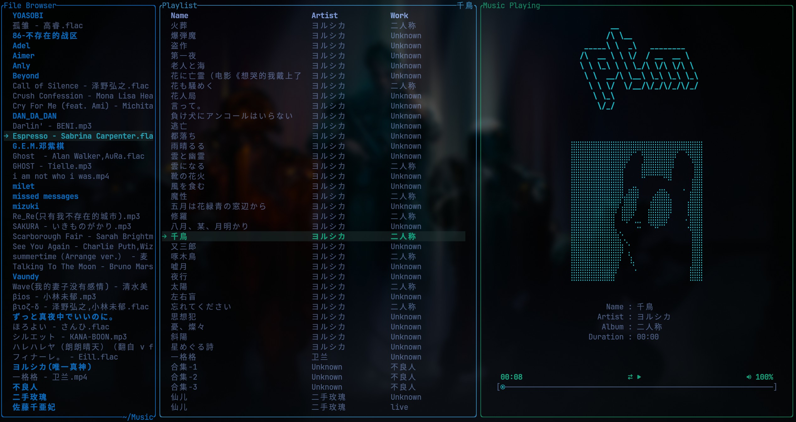

# ptm

---



ptm 是一个基于 rust 开发的终端音乐播放器
- 使用 ratatui 进行终端 ui 的绘制
- 使用 symphonia 进行音频的解析

正在开发中，很多功能还没有完善，开发出来的功能主要是个人喜好

#### 系统依赖

---

- nerdfont  
  很多 icon 是使用 nerdfont 的 icon

#### 使用方法

---

```sh
$ cd tui-music-player
$ cargo build -r 
$ ./target/release/tui-music-player
```

默认打开当前文件夹，如果需要切换文件夹，按照下面键位切换即可

- `f` 切换到文件管理器
  - `j` `k` 进行上下滚动
  - `h` `l` 表示进入上级/下级目录
  - `s` 将当前目录下所有音乐设置为播放列表（递归）
- `p` 切换到播放列表
  - `j` `k` 进行上下滚动
  - `h` `l` 上/下一首歌曲
  - `<space>` 暂停/播放
  - `<Tab>` 顺序/随机播放
  - `u` `i` 调节音量
  - `;` 播放歌曲

#### BUG

---

- [x] 不懂为什么 cpu 使用率特别高  
  需要开新的线程
  通过 `cargo build -r` 生成的二进制文件的 cpu 利用率变为了 0.0
- [ ] mp4 文件无法解析出帧数
- [ ] 在 home 目录打开，会很卡，我猜测是因为文件数目过多，导致在生成 play list 的时候需要耗费很多时间
- [x] 在切换 play list 之后，似乎 scroll bar 的长度没有更新

#### TODO

---

- [ ] UI 设计
   - [ ] 颜色
   - [ ] music info 的布局
- [ ] 快进功能
- [ ] 搜索功能
